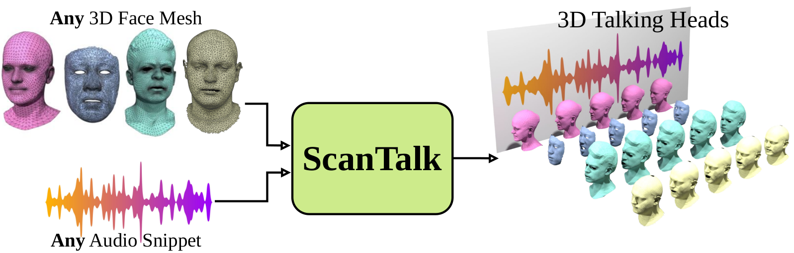
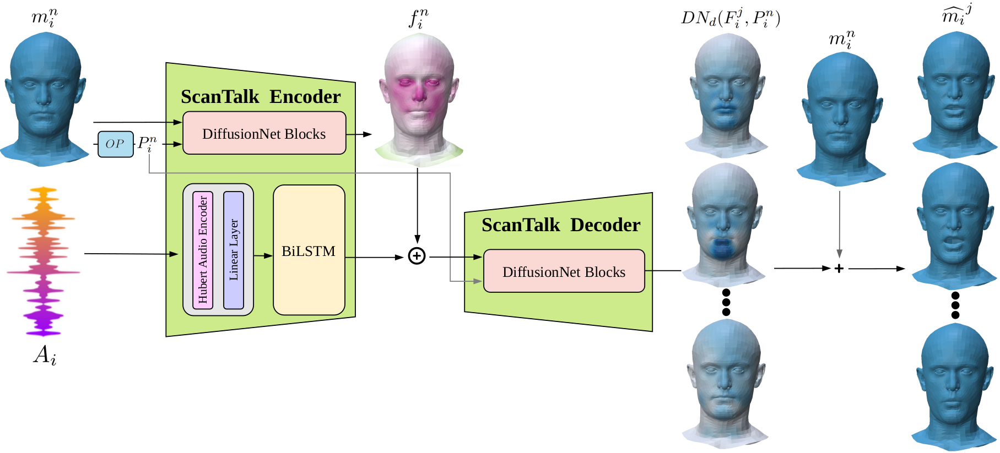

# ScanTalk (ECCV 2024)

### ScanTalk: 3D Talking Heads from Unregistered Scans

[](https://arxiv.org/abs/2403.10942)
[](https://fedenoce.github.io/scantalk/)
[](https://colab.research.google.com/drive/1obLydqYyv3bwzSaCYl5_HAVJGVj5VWRa#scrollTo=GnVAqrw65Ey4)
[](https://github.com/miccunifi/scantalk)


This is the **official repository** of the [**ECCV 2024 paper**](https://fedenoce.github.io/scantalk/) "*ScanTalk: 3D Talking Heads from Unregistered Scans*" by Federico Nocentini, Thomas Besnier, Claudio Ferrari, Sylvain Arguillere, Stefano Berretti, Mohamed Daoudi.

🔥🔥 **[2024/09/10] Our code is now public available! Feel free to explore, use, and contribute!** 🔥🔥

## Overview

Speech-driven 3D talking heads generation has emerged as a significant area of interest among researchers, presenting numerous challenges. Existing methods are constrained by animating faces with fixed topologies, wherein point-wise correspondence is established, and the number and order of points remains consistent across all identities the model can animate. 
In this work, we present ScanTalk, a novel framework capable of animating 3D faces in arbitrary topologies including scanned data. Our approach relies on the DiffusionNet architecture to overcome the fixed topology constraint, offering promising avenues for more flexible and realistic 3D animations. By leveraging the power of DiffusionNet, ScanTalk not only adapts to diverse facial structures but also maintains fidelity when dealing with scanned data, thereby enhancing the authenticity and versatility of generated 3D talking heads. Through comprehensive comparisons with state-of-the-art methods, we validate the efficacy of our approach, demonstrating its capacity to generate realistic talking heads comparable to existing techniques. While our primary objective is to develop a generic method free from topological constraints, all state-of-the-art methodologies are bound by such limitations. 


We present **ScanTalk**, a deep learning architecture to animate **any** 3D face mesh driven by a speech. ScanTalk is robust enough to learn on multiple unrelated datasets with a unique model, whilst allowing us to infer on unregistered face meshes.


**ScanTalk** is a novel Encoder-Decoder framework designed to dynamically animate any 3D face based on a spoken sentence from an audio file. The Encoder integrates the 3D neutral face $m_i^n$, per-vertex surface features $P_i^{n}$ (crucial for DiffusionNet and precomputed by the operators $OP$), and the audio file $A_i$, yielding a fusion of per-vertex and audio features. These combined descriptors, alongside $P_i^n$, are then passed to the Decoder, which mirrors a reversed DiffusionNet encoder structure. The Decoder predicts the deformation of the 3D neutral face, which is then combined with the original 3D neutral face $m_i^n$ to generate the animated sequence.

## Citation
```bibtex
@inproceedings{nocentini2024scantalk3dtalkingheads,
    title = {ScanTalk: 3D Talking Heads from Unregistered Scans},
    author = {Nocentini, F. and Besnier, T. and Ferrari, C. and Arguillere, S. and Berretti, S. and Daoudi, M.},
    booktitle = {Proceedings of the European Conference on Computer Vision (ECCV)},
    year = {2024},
  }
```

<details>
<summary><h2>ScanTalk Installation Guide</h2></summary> 

This guide provides step-by-step instructions on how to set up the ScanTalk environment and install all necessary dependencies. The codebase has been tested on **Ubuntu 20.04.2 LTS** with **Python 3.8**.

## 1. Setting Up Conda Environment

It is recommended to use a Conda environment for this setup.

1. **Create a Conda Environment**
    ```bash
    conda create -n scantalk python=3.8.18
    ```

2. **Activate the Environment**
    ```bash
    conda activate scantalk
    ```

## 2. Install Mesh Processing Libraries

1. **Clone the MPI-IS Repository**
    ```bash
    git clone https://github.com/MPI-IS/mesh.git
    ```

    ```bash
    cd mesh
    ```

2. **Modify line 7 of the Makefile to avoid error**
    ```
    @pip install --no-deps --config-settings="--boost-location=$$BOOST_INCLUDE_DIRS" --verbose --no-cache-dir .
    ```
3. **Run the MakeFile**
    ```bash
    make all
    ```

## 2. Installing PyTorch and Requirements

Ensure you have the correct version of PyTorch and torchvision. If you need a different CUDA version, please refer to the [official PyTorch website](https://pytorch.org/).

1. **Install PyTorch, torchvision, and torchaudio**
    ```bash
    conda install pytorch==2.1.0 torchvision==0.16.0 torchaudio==2.1.0 pytorch-cuda=12.1 -c pytorch -c nvidia
    ```

2. **Install Requirements**
    ```bash
    pip install -r requirements.txt
    ```
---

</details>

<details>
<summary><h2>Dataset Installation Guide</h2></summary> 


For training and testing ScanTalk, we utilized three open-source datasets for 3D Talking Heads: [**vocaset**](https://voca.is.tue.mpg.de/), [**BIWI**](https://paperswithcode.com/dataset/biwi-3d-audiovisual-corpus-of-affective), and [**Multiface**](https://github.com/facebookresearch/multiface). The elaborated and aligned datasets, all standardized to the vocaset format, used for both training and testing ScanTalk, can be found [**here**](https://drive.google.com/drive/folders/1KetNagXa9jcgYwnDUAJxDx5UJMx9yLL2?usp=sharing). After downloading, place the `Dataset` folder in the main directory.

</details>

<details>
<summary><h2>Pretrained Models Installation</h2></summary> 

We are releasing two versions of ScanTalk: one named `scantalk_mse.pth.tar`, trained using Mean Square Error Loss, and another named `scantalk_mse_masked_velocity.pth.tar`, which is trained with a combination of multiple loss functions. Both models are available for download [**here**](https://drive.google.com/drive/folders/1iH4ugUI_JoGiejZj3ENltxSIpUnFY4zl?usp=sharing). After downloading, place the `results` folder within the `src` directory.

</details>
<details>
<summary><h2>ScanTalk Training, Testing and Demo</h2></summary> 

The files `scantalk_train.py` and `scantalk_test.py` are used for training and testing, respectively. `scantalk_test.py` generates a directory containing all the ScanTalk predictions for each test set in the datasets. After obtaining the predictions, `compute_metrics.py` is used to calculate evaluation metrics by comparing the ground truth with the model's predictions.

You can use `demo.py` to run a demo of ScanTalk, animating any 3D face that has been aligned with the training set. Both audio and 3D face for the demo are in the  `src/Example` folder.
</details>

## Authors
* [**Federico Nocentini**](https://scholar.google.com/citations?user=EpQCpoUAAAAJ&hl=en)**\***
* [**Thomas Besnier**](https://scholar.google.com/citations?user=fc1gZk4AAAAJ&hl=en)**\***
* [**Claudio Ferrari**](https://scholar.google.com/citations?user=aael17YAAAAJ&hl=en)
* [**Sylvain Arguillere**](http://math.univ-lyon1.fr/~arguillere/)
* [**Stefano Berretti**](https://scholar.google.com/citations?user=3GPTAGQAAAAJ&hl=en)
* [**Mohamed Daoudi**](https://scholar.google.com/citations?user=7UoD6McAAAAJ&hl=en)

**\*** Equal contribution.

## Acknowledgements

This work is supported by the ANR project Human4D (ANR-19-CE23-0020) and by the [IRP CNRS project GeoGen3DHuman](https://geogen3dhuman.univ-lille.fr). It was also partially supported by "Partenariato FAIR (Future Artificial Intelligence Research) - PE00000013, CUP J33C22002830006", funded by NextGenerationEU through the Italian MUR within the NRRP, project DL-MIG. 
Additionally, this work was partially funded by the ministerial decree n.352 of the 9th April 2022, NextGenerationEU through the Italian MUR within NRRP, and partially supported by Fédération de Recherche Mathématique des Hauts-de-France (FMHF, FR2037 du CNRS).

## LICENSE

<a rel="license" href="http://creativecommons.org/licenses/by-nc/4.0/"></a><br />All material is made available under [Creative Commons BY-NC 4.0](https://creativecommons.org/licenses/by-nc/4.0/). You can **use, redistribute, and adapt** the material for **non-commercial purposes**, as long as you give appropriate credit by **citing our paper** and **indicate any changes** that you've made.
